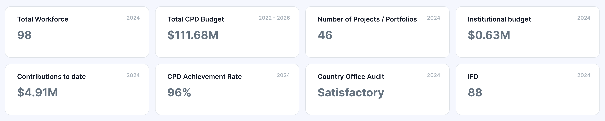
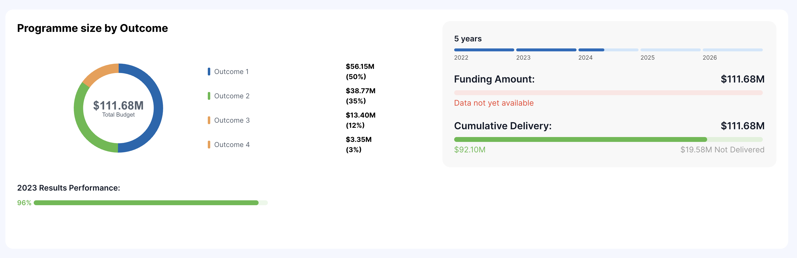

# Country Office Overview

The Country Office Overview page shows key details at a glance. It is an excellent resource for leaders to understand the status of a UNDP Country Office quickly.

## Leadership Details

These details are taken from two Sharepoint lists that are maintained by OHR (Office of Human Resources):

* [RR (Resident Representative) Directory](https://undp.sharepoint.com/teams/OHR-Portal/SitePages/Resident-Representative-Directory.aspx?xsdata=MDV8MDJ8ZW1hbnVlbGUuZmFqYUB1bmRwLm9yZ3xiODhlYWY1ZDE5MGI0NDM2ZjBjYjA4ZGM2ODUzOWZjOXxiM2U1ZGI1ZTI5NDQ0ODM3OTlmNTc0ODhhY2U1NDMxOXwwfDB8NjM4NDk5OTU2NzMyNjgyNDYxfFVua25vd258VFdGcGJHWnNiM2Q4ZXlKV0lqb2lNQzR3TGpBd01EQWlMQ0pRSWpvaVYybHVNeklpTENKQlRpSTZJazFoYVd3aUxDSlhWQ0k2TW4wPXwwfHx8\&sdata=alNIanJBWUdVZ0dqQ2Y4MXMxY1lROFhzOWg4ejBNUmtSbEt1ZUJUUis5ND0%3d)
* [DRR (Deputy Resident Representative) Directory ](https://undp.sharepoint.com/teams/OHR-Portal/SitePages/Deputy-Resident-Represntative-Directory.aspx?xsdata=MDV8MDJ8ZW1hbnVlbGUuZmFqYUB1bmRwLm9yZ3xiODhlYWY1ZDE5MGI0NDM2ZjBjYjA4ZGM2ODUzOWZjOXxiM2U1ZGI1ZTI5NDQ0ODM3OTlmNTc0ODhhY2U1NDMxOXwwfDB8NjM4NDk5OTU2NzMyNzA0NzY5fFVua25vd258VFdGcGJHWnNiM2Q4ZXlKV0lqb2lNQzR3TGpBd01EQWlMQ0pRSWpvaVYybHVNeklpTENKQlRpSTZJazFoYVd3aUxDSlhWQ0k2TW4wPXwwfHx8\&sdata=R2QzcEZNdnR3NG1PTzRZVlc4Z01XbUF2R3FLWXBQQ2hFd3pSN2RtNldGcz0%3d)


Some country offices split the DRR role into Operations (o) and Programme (p). When this happens, we will show the programme DRR details.


## Key Overview Details Cards

<figure><figcaption></figcaption></figure>

| Card Title                    | Card Description                                                                                                                                                                            |
| ----------------------------- | ------------------------------------------------------------------------------------------------------------------------------------------------------------------------------------------- |
| Total Workforce               | Pulled from the OHR dashboard. This includes the entire workforce, including staff, IPSA/NPSA, IC, UNVs, and interns, etc.                                                                  |
| Total CPD Budget              | Data that has been manually taken from the current CPD document.                                                                                                                            |
| Number of Projects/Portfolios | Number of unique projects/portfolios that are currently active, taken from the Master Project List.                                                                                         |
| Institutional Budget          | Shows the institutional budget as of today for the current year.                                                                                                                            |
| Contributions to Date         | Annual contributions to date, taken from the Data Cube (same data source as UNDP-at-a-Glace) and as displayed in Contributions indicator.                                                   |
| CPD Achievement Rate          | Shows the previous year's CPD achievement rate. This is the average of each CPD Output indicator's achievement rate, which is defined as the annual progress compared to the annual target. |
| Country Office Audit          | This shows the most recently available Country Office Performance Audit result, and the year it occurred.                                                                                   |
| IFD                           | We show the latest Integrated Financial Dashboard result.                                                                                                                                   |

## Performance Score Card

<figure><figcaption></figcaption></figure>

* **IRRF Milestones Met —** This shows the IRRF score based on the[ IRRF Indicator Methodology.](impact/irrf.md)
* **CPD  —** {to be added}
* **IFD —** Shows the IFD scoring based on the [IFD methodology](accountability/integrated-financial-dashboard-ifd.md) (the IFD card in Key Overview Details Cards) shows the actual IFD category.
* **PQA —** Shows the PQA scoring based on the [PQA methodology. ](accountability/project-quality-assurance.md)
* **Audit —** Shows the audit scoring based on the [Audit methodology.](accountability/country-office-performance-audits.md)
* **Delivery —** Shows the delivery score based on the [Delivery methodology. ](efficiency/delivery.md)
* **Contributions —** Shows the contributions score based on the [Contributions methodology.](efficiency/contributions.md)
* **SESP —** Shows the SESP score based on the [SESP methodology. ](values/sesp.md)
* **Greening Moonshot —** Shows the Greening Moonshot score based on the [Greening Moonshot methodology. ](values/greening-moonshot.md)
* **Transparency —** This currently shows each country's global score; should this be removed?&#x20;
* **Engagement Index —** Shows the country score in the latest engagement index
* **Turnover Rate —** Shows the turnover rate score based on the [Turnover methodology. ](people/turnover-rate.md)
* **Gender Parity —** Shows the gender parity score based on the [Gender Parity methodology. ](people/gender-parity.md)

## CPD Overview

### Programme Overview

<figure><figcaption></figcaption></figure>

* **Total Budget —** Budget that has been manually taken from the current CPD document.
* **Outcome x —** Budget for the specific Outcome that has been manually taken from the current CPD document, and we show how much the Outcome is of the % of the full CPD Budget
* **2023 Results Performance —** The average % completion of all Output for the previous year.&#x20;
* **CPD Year—**Shows the start and end years of the CPD and where we are in the CPD timeline as of today.
* **Funding Amount —** Shows the total funding amount required for the CPD budget. We do not have the data for actuals-to-date as we are waiting on OFRM for additional data points.
* **Cumulative Delivery —** This counts the delivery for each year of the CPD plus the total to-date for the current year.&#x20;

### Outcome Overview

### Unlinked Projects

Some projects are supposed to be linked based on the project type, but they are not linked for some reason. This can be due to the data structure that we cannot programmatically link them to CPD Outcomes.&#x20;

### Programme by Funding Partner Type

* We should have this, we will need to investigate.&#x20;
* From IATI\_Financials
* Do a sum for the CPD period&#x20;
* Disagreeagte by FUND\_CODE

### Major Implementing Partners

* List all the projects
* Sum all the budgets
* Disagreegate by Implementing Partner Type

## Pipeline Analytics

### Pipeline Stat Cards

This is taking information directly from Unity, the official UNDP CRM.

<figure><figcaption></figcaption></figure>


**Pipeline Stages Explained**

UNDP&#x20;


* **Total Number of Opportunities —** This counts the number of active opportunities from Unity across all the different pipelines.&#x20;
* **Total Pipeline Value —** This is the sum of the value of all opportunities across all the different pipeline stages. {Are we applying the discounts for this?}
* Average Opportunity Value — Again, is this discounted or not?
* **Close Rate —** This is the percentage of opportunities that lead to signed agreements in the previous calendar year.&#x20;
* **Total Number of Opportunities (Pipeline A) —** Total number of Unity opportunities in Pipeline A for the country office.&#x20;
* Total Pipeline A Value — Is this discounted or not discounted?&#x20;
* **Total Number of Opportunities (Pipeline B) —** Total number of Unity opportunities in Pipeline B for the country office.&#x20;
* Total Pipeline B Value — is this discounted or not discounted?&#x20;


This should be discounted pipeline values and change the names of the cards to "discounted" to make it clear so we dont get any question about it.&#x20;


### Pipeline Graphs

<figure><figcaption></figcaption></figure>
